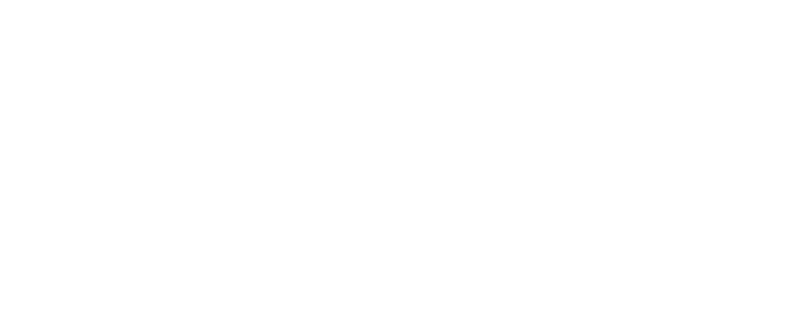

# WRA Cavalry Assistant

An AI assistant for [Cavalry](https://cavalry.scenegroup.co/) that lets Claude write and run Cavalry scripts directly — no copy-pasting, no switching windows.

---

## What it does

- **Write & run scripts** — Claude executes Cavalry JavaScript live via the Stallion bridge
- **Knows the docs** — searches 40,000+ chunks of Cavalry documentation, real scenes, and community knowledge semantically
- **Scene-aware** — reads and saves your active scene
- **Stays current** — auto-loads a verified best-practices reference on every session

---

## Requirements

| Tool | Purpose |
|------|---------|
| [Cavalry](https://cavalry.scenegroup.co/) | The app — needs Stallion enabled |
| [Node.js 18+](https://nodejs.org/) | Runs the MCP server |
| [Ollama](https://ollama.com/) | Local embeddings |
| [Claude Code](https://claude.ai/claude-code) | The AI client |

---

## Quick Setup (pre-built knowledge base)

### 1. Clone and install

```bash
git clone <repo-url> cavalry-assistant
cd cavalry-assistant
cp .env.example .env
npm install --prefix mcp
npm run build --prefix mcp
```

### 2. Download the knowledge base

Download `lancedb_public.zip` from [GitHub Releases](../../releases/latest), extract into the project:

```
cavalry-assistant/
  data/
    lancedb_public/    ← extract here
```

Update `.env`:

```env
LANCEDB_PATH=./data/lancedb_public
```

> **Windows / network drive users:** LanceDB requires a local drive. Set an absolute local path:
> `LANCEDB_PATH=C:/Users/yourname/.cavalry-assistant/lancedb_public`

### 3. Start Ollama

```bash
ollama pull nomic-embed-text
```

### 4. Enable Stallion in Cavalry

`Scripts > Stallion` — leave it running on port 8080.

### 5. Connect to Claude Code

The `.mcp.json` in this folder auto-registers when opened in Claude Code. Or manually:

```bash
claude mcp add cavalry-assistant node mcp/dist/index.js
```

### 6. Start a session

```
/cavalry
```

---

## Knowledge Base

The pre-built public knowledge base includes:

| Source | Content |
|--------|---------|
| Official docs | Full Cavalry documentation |
| Scenery scenes | 270 real `.cv` scene files — real-world node/connection patterns |
| Manual reference | Curated scripting patterns and best practices |
| Scripts | Example JavaScript scripts |

The public knowledge base **does not** include Discord community data (private).

---

## Building the Knowledge Base (contributors)

To build your own private knowledge base with all sources including Discord:

### 1. Set up Python

```bash
cd etl
pip install -r requirements.txt
```

### 2. Configure `.env`

Set a local path for your private DB and add credentials:

```env
LANCEDB_PATH=C:/Users/yourname/.cavalry-assistant/lancedb
DISCORD_TOKEN=your_token
DISCORD_CHANNEL_IDS=channel_id_1,channel_id_2
SCENERY_COOKIE=your_session_cookie
```

### 3. Run ETL

```bash
cd ..  # project root

# Public sources
python etl/ingest.py --source docs
python etl/ingest.py --source scenery
python etl/ingest.py --source manual
python etl/ingest.py --source scripts
python etl/ingest.py --source cv

# Private sources (stays local, never exported)
python etl/ingest.py --source discord
```

### 4. Export and publish a public release

```bash
# Build public snapshot (filters out Discord)
python etl/export_public_db.py --zip

# Publish to GitHub Releases
gh release create v1.x --title "Knowledge Base v1.x" data/lancedb_public.zip
```

### 5. Add new scenes from Scenery

```bash
# Scrape new .cv files
python etl/scrape_scenery.py

# Ingest and re-export
python etl/ingest.py --source cv
python etl/export_public_db.py --zip
```

---

## Good to know

- Stallion always responds `"Success"` — check Cavalry's console panel for actual errors
- Always start scene-modifying scripts with `api.stop()`
- Full API reference: `prompts/cavalry-best-practices.md`
- The public DB is always a clean snapshot — no Discord messages, no credentials, no user data

---

## Credits

Built with:

- [Cavalry](https://cavalry.scenegroup.co/) by **Scene Group** — the animation software this wraps
- [Stallion](https://docs.cavalry.scenegroup.co/) — Cavalry's built-in scripting bridge
- [Model Context Protocol SDK](https://github.com/modelcontextprotocol/typescript-sdk) by **Anthropic**
- [LanceDB](https://github.com/lancedb/lancedb) — vector database for RAG
- [Ollama](https://ollama.com/) + [nomic-embed-text](https://ollama.com/library/nomic-embed-text) — local embeddings

Knowledge base sourced from the [Cavalry official docs](https://docs.cavalry.scenegroup.co/), [Scenery](https://scenery.io/), and the Cavalry community.
